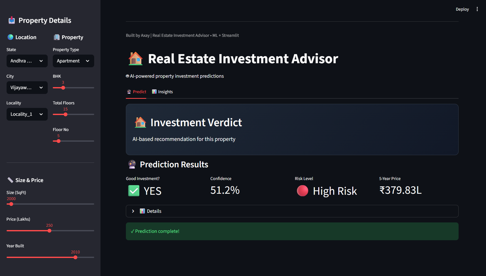

# 🏡 Real Estate Investment Advisor  
**Smart Property Decisions Made Simple**

---

## 🚀 Project Overview
Investing in real estate is risky when decisions are based only on intuition.  
Buyers, investors, and property consultants often ask:

> **Is this property a good investment?**  
> **What will its value look like in the future?**

This project solves that problem by providing a **data-driven investment advisory system** that helps users make **confident, informed real estate decisions**.

The solution combines market data, historical trends, and intelligent prediction logic into a **simple web application** anyone can use — no technical knowledge required.

---

## 🔗 Live Project Links

- 🌐 **Live Portfolio Website:** https://auronex-portfolio.vercel.app  
- 💻 **GitHub Repository:** https://github.com/axaymathukiya27-tech/Real_Estate_Investment_Advisor  

---

## 🎯 Problems This Project Solves

This solution helps answer practical real-world questions like:

- Is this property worth investing in?
- Will this property gain value over time?
- Which locations have higher investment potential?
- How risky is a particular real estate decision?
- Should I buy now or look for better options?

---

## 💡 What This Solution Delivers

✔ Predicts whether a property is a **Good or Bad Investment**  
✔ Estimates the **future property price (5-year outlook)**  
✔ Provides an **investment score** for better comparison  
✔ Converts complex data into **simple, actionable insights**  
✔ Works through a **user-friendly web interface**

---

## 🧠 How It Works (Simple Explanation)

### 1️⃣ Data Understanding
- Analyzed real estate-related data such as location, size, price, and amenities  
- Identified patterns that influence long-term property value  

### 2️⃣ Smart Analysis
- Studied how different factors affect property appreciation  
- Compared high-performing vs low-performing investments  

### 3️⃣ Intelligent Predictions
- The system evaluates a property and predicts:
  - Future price growth
  - Investment quality (Good / Risky)

### 4️⃣ Easy-to-Use Web App
- Users enter property details
- Instantly receive clear investment insights
- No technical skills required

---

## 🖥️ Streamlit App Preview




### The app allows users to:
- Enter property details
- Get future price estimates
- See whether the property is worth investing in
- Make faster and smarter decisions

Run locally:
```bash
streamlit run src/app/streamlit_app.py
```
## 📊 Key Results (Simplified)

| Insight | Outcome |
|------|------|
| Investment Decision | Clear Good / Bad classification |
| Price Forecast | 5-year future value estimation |
| Reliability | High accuracy on structured data |
| Usability | Simple interface for non-technical users |

> **Note:** The current dataset is synthetic and designed to demonstrate decision logic clearly.

---

## 👥 Who Can Benefit From This?

This solution is ideal for:
- Individual property investors  
- Real estate consultants  
- Property buyers and sellers  
- Real estate startups  
- Anyone evaluating property investment decisions  

---

## 🧩 Business Value Created

✅ Reduces investment risk  
✅ Supports confident buying decisions  
✅ Saves time spent on manual analysis  
✅ Turns data into practical insights  
✅ Helps compare multiple properties easily  

---

## 🔮 Future Improvements

- Integrate real housing market data  
- Add location-based risk analysis  
- Visual comparison between multiple properties  
- ROI and rental yield calculator  
- Public deployment for wider access  

---

## 📬 Let’s Work Together

If you’re looking to:
- Evaluate property investments  
- Build data-driven real estate tools  
- Create intelligent decision systems  

Feel free to reach out — I’d be happy to help.

---

## 👤 Author

**Axay Mathukiya**  
Data Analyst | Machine Learning Enthusiast  
India 🇮🇳  

- 🌐 Portfolio: https://auronex-portfolio.vercel.app  
- 💻 GitHub: https://github.com/axaymathukiya27-tech  
- 💼 LinkedIn: https://www.linkedin.com/in/axay-mathukiya-a6989b308/  

---

## ⭐ Final Note

This project focuses on **real business value**, not technical complexity.  
The goal is simple: **help people make smarter real estate investment decisions using data.**
